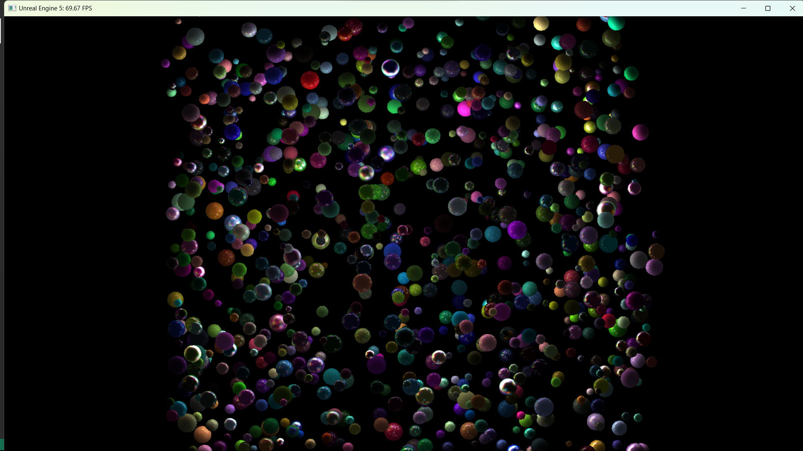
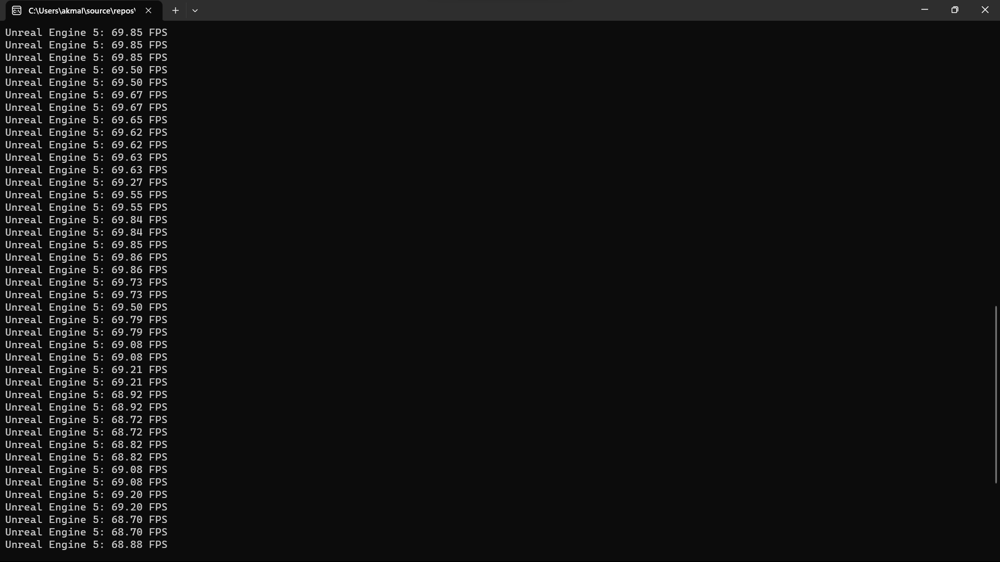

# Sphere raycasting in CUDA

## Prerequisites
- Windows (recommended version >= 10)
- [CUDA](https://developer.nvidia.com/cuda-toolkit) (recommended version >= 12)

### Optional
- [GnuWin](https://gnuwin32.sourceforge.net/install.html) (if you are crazy enough to use `make` on Windows)

## Usage

### Microsoft Visual Studio
1. Open project solution `sphere-raycasting.sln`
2. Add `lib/freeglut.lib` as an additional dependency:
    - Open `Project->Properties`;
    - Open `Linker->Additional Library Directories` and add `lib`;
    - Open `Linker->Input->Additional Dependencies` and add `freeglut.lib`.
3. Start without debugging (`Ctrl+F5`). Note: Use only `Release` version, otherwise the program will run very slow.

### Makefile
1. Open project folder in the command prompt
2. Build the project:
```
$ make
```
3. Run the project:
```
$ main.exe
``` 

## Screenshots



## Notes
- Inspired by [jtarkowski27](https://github.com/jtarkowski27/sphere-raycasting)